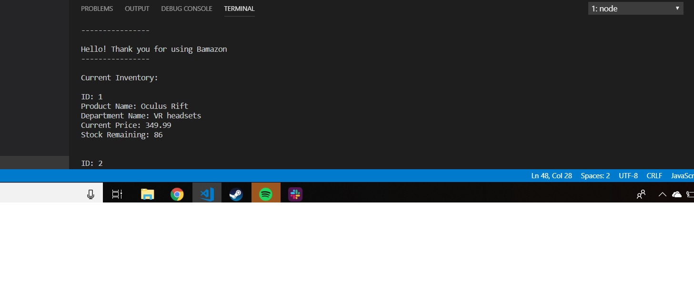
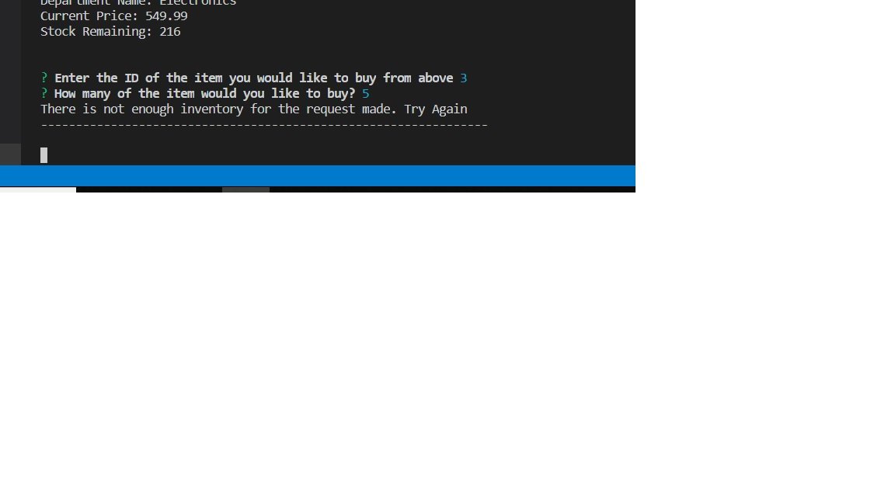
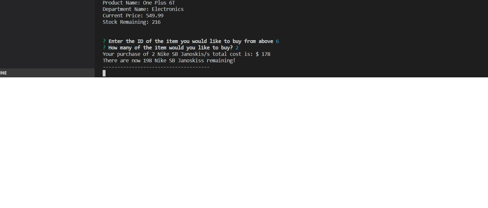
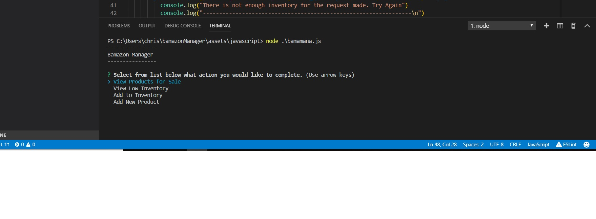
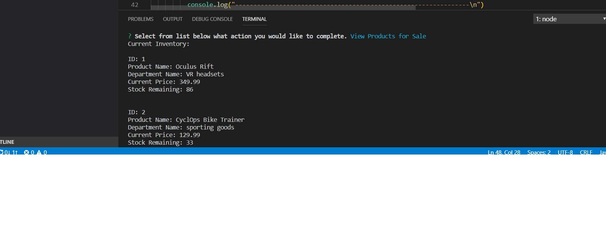
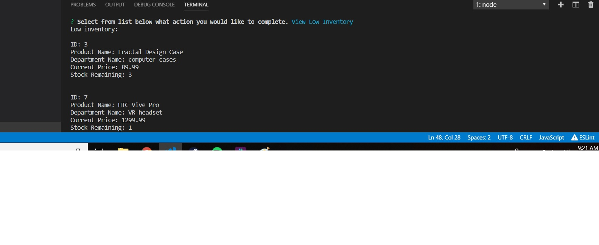

# bamazonManager
Welcome to Bamazon!
Bamazon is a node based application that allows it's users to purchase items based on an inventory saved inside
the local MYSQL database.
Upon entry to Bamazon a user is shown a list of all the available items for purchase, including the department the item is stored in, its ID, the product name and amount of item as shown below.

After the user selects an item they would like to purchase, they are prompted the ID of the item they would like and the amount of the item they would like to purchase. If the user inputs a value higher than the amount remaining in the inventory they will be sent back an error stating that there is not enough of the item to complete the purchase.

If there is enough of the product left to purchase, the user will be charged for the amount and the items will be subtracted from the Stock Quantity in the database on SQL.

On the Bamazon Manager side of the application. Management Level users are able to come and either View the Current Products, Check the Low Inventory, Add to the current Inventory of an item or Add an entirely New Product.

Upon viewing the Inventory, the manager will receive a list of items similar to what the customer sees upon first viewing the website laying out all the available inventory.

If the Management Team Member decides to Check the low inventory, the user will see all the inventory that contains less than 5 remaining stock left.

Upon clicking Add
